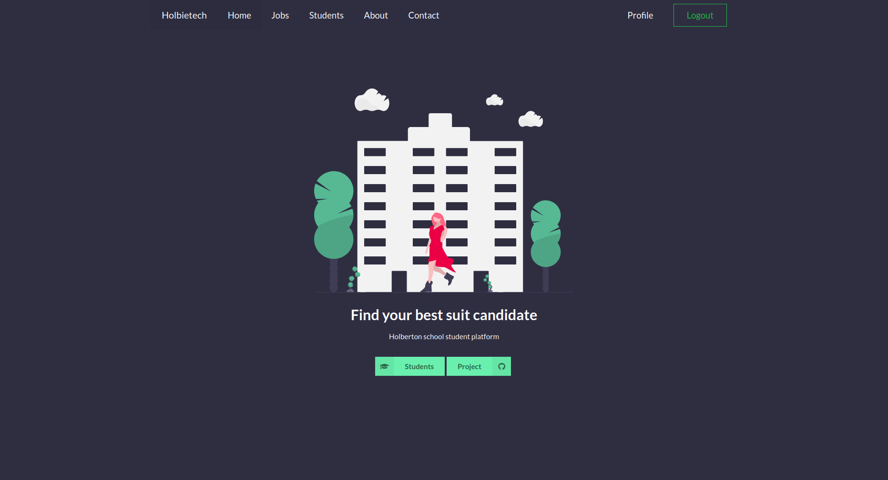

## Holbie.tech :wave:

_**Holbie.tech**_ is a library of profile and resume for **Holberton school** student. Is a uniq platform when student
can share their resume, taking recommendation and review, Applying for job posts.
It's also a company and recruiter window to take a look at Holberton Student skills, find their best suit candidate
and share job posts with student and School staff.


## Technically speaking :wrench:

_**Holbie.tech**_ build in two separate environment:
* Backend environment build by `Python/Flask` framework as RestFull API. we decide to move on with `Flask` because it's flexible
and for student we see it's the best choice to get our hand dirty and learn some backend inner traffic avoiding as much as possible 
abstraction and pre-pared library. We build our backend based on Models which was our link between the controller (or the api provider)
and the ORM-SqlAlchemy. each API request protected by the JWT encoding.
* Frontend environment build by `ReactJS` and it was a great opportunity to build something meaningful and working website.

## You like to test it :nut_and_bolt:
If you want to test our web application you need to make few steps before you get it run and if you encounter any problem don't be shy
you find us here all the time for help. just ask :wink:
First you need to get this repository on your local machine, sorry the only way to get a look on it is by run it locally. we have dream to take the 
application to the word and be sure you'll be the first to know.
```bach
git clone https://github.com/KoeusIss/holbie.tech.git ~/
```
Then let's handle the backend dependencies by installing python and setting up a decent environment. In order to avoid any problems you need to install these packages
```bash
sudo apt-get install python3-dev
sudo apt-get install libmysqlclient-dev
sudo apt-get install zlib1g-dev
```
Now try to create a separate environment in this example we use `virtualenv` and `pip` but you are free to use whatever you like. And install all the backend requirement.
```bash
cd ~/holbie.tech
python3 -m venv holbie
source holbie/bin/activate
pip install -r web_falsk/requirements.txt
```
For the frontend packages.
```bash
yarn install
```
Now we hope that everything goes ok with you, and all is ready to run the web application, in two separate terminal run
```
yarn start
```
which run the frontend environment on port 3000.
In the second window run
```
yarn run-flask
```
Which run the backend environment on port 5000
To get the same landing on page in this repository put `localhost:3000` on your browser


# Authors
Issam Sebri - Machine learning enthusiast & full stack developer - [Linkedin](https://www.linkedin.com/in/issam-sebri/) - [Twitter](https://twitter.com/KoeusIss)
